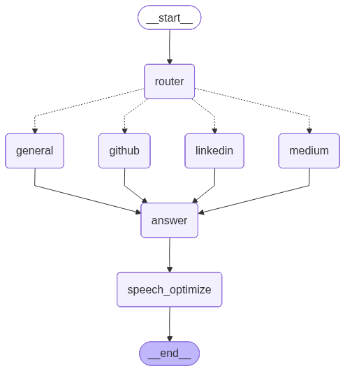

# Digital Twin Backend

A conversational AI system that serves as a digital twin, providing intelligent responses about professional background, projects, and published articles. The system uses RAG (Retrieval-Augmented Generation) with vector search and includes text-to-speech capabilities for natural voice interactions.

<figure>
  
  <figcaption>Figure 1: LangGraph Workflow Diagram: Multi-Source Agent Routing and Processing</figcaption>
</figure>

## Features

- **Intelligent Query Routing**: Automatically routes questions to the appropriate data source (LinkedIn, GitHub, Medium)
- **Vector Search**: Efficient semantic search using ChromaDB and OpenAI embeddings
- **Speech Optimization**: Answers are automatically optimized for text-to-speech output
- **Voice Synthesis**: Self-hosted Coqui TTS for natural voice responses
- **Multi-language Support**: Handles queries in multiple languages with automatic translation to English
- **LangSmith Integration**: Full observability and prompt tracking for monitoring and debugging

## Architecture

The system is built using LangGraph with the following workflow:
```
User Query → Router → Context Retrieval → Answer Generation → Speech Optimization → TTS
```

### Components

- **Router Node**: Analyzes questions and routes to appropriate data source
- **Retrieval Nodes**: Fetches relevant context from vector store (LinkedIn/GitHub/Medium)
- **Answer Node**: Generates contextual answers using GPT-4
- **Speech Optimization Node**: Transforms answers for natural voice output
- **TTS Service**: Converts text to speech using Coqui TTS

## Technology Stack

- **Framework**: LangGraph, FastAPI
- **LLM**: OpenAI GPT-4
- **Embeddings**: OpenAI text-embedding-3-large
- **Vector Store**: ChromaDB
- **TTS**: Coqui TTS (VCTK model)
- **Observability**: LangSmith

## Project Structure
```
digital-twin-backend/
├── src/
│   ├── __init__.py
│   ├── create_database.py      # Vector store creation
│   ├── run_agent.py             # Main agent logic
│   └── api/
│       ├── main.py              # FastAPI application
│       └── tts_service.py       # Text-to-speech service
├── data_processed/              # Preprocessed documents
│   ├── linkedin.json
│   ├── github_readmes/
│   └── medium_articles/
├── chroma_db/                   # Vector store (generated)
├── requirements.txt
├── render.yaml                  # Render deployment config
└── .env.example
```

## Installation

### Prerequisites

- Python 3.9+
- Virtual environment (recommended)

### Setup

1. Clone the repository:
```bash
git clone https://github.com/yauheniya-adesso/digital-twin-backend.git
cd digital-twin-backend
```

2. Create and activate virtual environment:
```bash
uv venv --python 3.11
source venv/bin/activate  # On Windows: venv\Scripts\activate
```

3. Install dependencies:
```bash
uv pip install -r requirements.txt
```

4. Configure environment variables:
```bash
cp .env.example .env
```


5. Create vector database:
```bash
python -m src.create_database
```

To recreate the database:
```bash
python -m src.create_database --force
```

## Usage

### Local Development

Run the agent locally:
```bash
python -m src.run_agent
```

Start the API server:
```bash
uvicorn src.api.main:app --reload --host 0.0.0.0 --port 8000
```

Access the API documentation at: `http://localhost:8000/docs`

### API Endpoints

**POST /api/ask**
```json
{
  "question": "What is Yauheniya's educational background?",
  "user_id": "anonymous"
}
```

Response:
```json
{
  "text": "Yauheniya has a diverse educational background...",
  "audio": "524946464c..." 
}
```

**GET /health**

Health check endpoint for monitoring.

### Testing Audio Output

Use the provided Jupyter notebook to test TTS responses:
```python
import requests
from IPython.display import Audio

response = requests.post(
    "http://localhost:8000/api/ask",
    json={"question": "Tell me about your projects"}
)

data = response.json()
audio_bytes = bytes.fromhex(data["audio"])
Audio(audio_bytes)
```

## Deployment

### Render

The application is configured for deployment on Render using `render.yaml`.

1. Push your code to GitHub
2. Connect your repository to Render
3. Configure environment variables in Render dashboard
4. Deploy

The application will automatically install dependencies and start the server.

### Environment Variables (Production)

Set these in your Render dashboard:
- `OPENAI_API_KEY`
- `OPENAI_BASE_URL`
- `LANGCHAIN_TRACING_V2`
- `LANGCHAIN_ENDPOINT`
- `LANGCHAIN_API_KEY`
- `LANGCHAIN_PROJECT`

## Data Processing

The system expects documents in `data_processed/`:

- **LinkedIn**: `linkedin.json` - Professional profile data
- **GitHub**: `github_readmes/*.md` - Project documentation
- **Medium**: `medium_articles/*.md` - Published articles

Documents were preprocessed to approximately 1000 characters each for optimal retrieval.

## Monitoring

The system integrates with LangSmith for complete observability:

- Query routing decisions
- Context retrieval results
- LLM prompts and responses
- Token usage and latency
- Error tracking

Access traces at: https://smith.langchain.com/

## License

MIT

